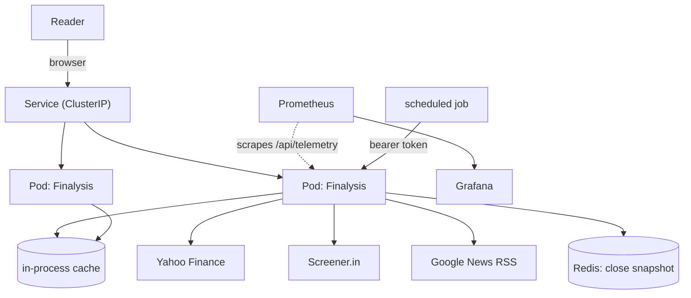

# Local infrastructure

Everything in this directory is local and free. There is no cloud account, no
trial, no paid API and no hosted monitoring anywhere in it. The most it needs is
a container runtime, a kind cluster and roughly 6 GB of memory.

## What this is for

Finalysis reads from three third-party providers that all fail sometimes. The
application already handles that — a cache, a circuit breaker, bounded retries,
stale-while-error fallbacks, and a page that says how old a number is. This
directory is the part that makes that visible and testable: a container, probes,
a cluster that restarts things, and metrics that show the fallbacks firing.



The dashed line is the only one that matters for the dashboard: Prometheus does
not scrape the providers, it scrapes the application, and the application tells
it what happened when it called them.

## Prerequisites

| Tool | Why | Install |
| --- | --- | --- |
| Docker or Podman | builds and runs the image | already present |
| kind | the local cluster | `deploy/scripts/fetch-tools.sh` |
| kubectl | talks to the cluster | same |
| helm | installs the chart | same |
| terraform | optional, for the IaC path | same |

`fetch-tools.sh` downloads the four binaries into `.tools/`, which is gitignored.
Nothing is installed system-wide and nothing needs a package manager with root.

## The whole thing, in order

```bash
deploy/scripts/fetch-tools.sh        # one-off: kind, kubectl, helm, terraform
deploy/scripts/build.sh              # build the image
deploy/scripts/run-local.sh          # just run it, no cluster
deploy/scripts/cluster-up.sh         # create kind, load the image
deploy/scripts/apply.sh              # apply deploy/kubernetes
deploy/scripts/monitoring.sh         # Prometheus + Grafana
```

Then:

```bash
.tools/kubectl -n finalysis port-forward svc/finalysis 8080:80
# http://localhost:8080
```

To tear it all down:

```bash
deploy/scripts/teardown.sh
```

## Why the probes are not the same probe

This is the part most worth explaining, and it is the part a reviewer should
push back on if it looks wrong.

`/api/health` is liveness. It answers from the process alone. It never calls a
provider, never touches Redis and never depends on configuration.

`/api/health/ready` is readiness. It also checks nothing external. It reports
whether Redis and a cron secret are configured, but does not fail on either.

Both refusals are deliberate:

- If **liveness** consulted a provider, a Yahoo outage would fail the probe,
  Kubernetes would kill every pod, and a restart loop would be layered on top of
  the outage. The pod was healthy. It was being asked the wrong question.
- If **readiness** consulted a provider, the pod would be pulled from the
  Service during an outage. That removes the one pod that could still serve a
  cached price with a visible "as of" time, turning a partial outage into a
  total one.

So a degraded upstream is reported in three other places — the
`finalysis_price_freshness_total` metric, the page's own freshness wording, and
the dashboard — rather than by taking the pod out of rotation.

A `startupProbe` gives a cold Node process up to 60 seconds before liveness
starts counting failures, so a slow start is not mistaken for a hang.

## Failure tests

`deploy/scripts/failure-tests.sh` runs four of them against a live cluster and
prints what it observes. They are observational on purpose: a failure test whose
result you cannot see is not a test.

1. **Pod deleted** — Kubernetes recreates it.
2. **Process frozen with SIGSTOP** — the liveness probe's requests hang, and the
   probe restarts it. This is the case that distinguishes liveness from
   readiness.
3. **Readiness with no providers reachable** — still Ready, and says so.
4. **Scheduled job with no secret** — returns 503, not an open endpoint.

## What was verified, and what was not

This matters more than the diagrams, so it is stated plainly.

**Verified by running it on the machine this was written on:**

- The image builds and runs. It contains no package manager, no lockfile, no
  source and no tests, and runs as uid 1000.
- The application serves pages, the API, the health endpoints and the telemetry
  endpoint from that image.
- The hardened security context works: `--read-only` root filesystem, non-root,
  all capabilities dropped, `no-new-privileges`. Zero permission errors in the
  logs.
- Standalone Next output runs on its own before being put in an image.
- Prometheus scrapes the application and the counters move when requests are
  made (`up = 1`, then metric values rising after five requests).
- Killing the application flips the Prometheus target to `up = 0`.
- `promtool check config` accepts the scrape configuration.
- `helm lint` and `helm template` pass, and the values genuinely change the
  rendered output.
- `terraform fmt -check` and `terraform validate` pass.

**Not verified, and why:**

- **The kind cluster was never created.** This environment has no root, and
  rootless podman needs QEMU, which needs root to install. The manifests,
  chart and scripts are written to be correct, but no `kubectl get pods` output
  was produced here, and no in-cluster failure test was run. Run
  `cluster-up.sh` and `apply.sh` on a machine with Docker or a podman machine to
  close that gap.
- **Grafana was not started.** The dashboard JSON parses and the provisioning
  files are written, but the rendered dashboard has not been viewed.
- **Terraform `plan` and `apply` were not run.** They need a live cluster. `init`
  and `validate` do not, and both pass.

## Monitoring

`deploy/monitoring/prometheus.yml` scrapes `/api/telemetry`. Deliberately not
`/api/metrics`, which is the company-data API the web page calls.

The dashboard answers the questions the resilience layer exists for: is an
upstream answering, is a reader being served an old price, is the circuit
breaker open, is the cache doing its job, and are requests being rate limited.

Label discipline is enforced in code rather than documented. `lib/observability`
declares every metric's label names and allowed values up front and throws on an
undeclared combination, so a ticker symbol cannot become a time series. That is
what stops a scrape from growing without bound as readers search for more
symbols.

## Helm

The chart exposes only what an operator has a reason to change: replica count,
image, resources, service, probes, environment, an optional existing Secret, and
an optional ingress. Everything else is a constant in the template.

```bash
deploy/scripts/helm.sh --set replicaCount=3
.tools/helm uninstall finalysis -n finalysis
```

Both the chart and the raw manifests describe the same application. The raw
manifests are the readable reference; the chart is the installable form.

## Terraform

Terraform manages the namespace, a ServiceAccount, and the Helm release. It does
not re-express the Deployment, Service or NetworkPolicy as HCL: that would create
two definitions of one workload and guarantee they drift.

```bash
cd deploy/terraform
../../.tools/terraform init
../../.tools/terraform plan -var kube_context=kind-finalysis
../../.tools/terraform apply -var kube_context=kind-finalysis
../../.tools/terraform destroy -var kube_context=kind-finalysis
```

`plan` and `apply` need a running cluster. `init` and `validate` do not.

No cloud provider is configured, and none is needed. `CRON_SECRET` and
`KV_REDIS_URL` are not Terraform variables at all — a value in a variable would
land in `terraform.tfstate`, and the configuration references a Secret by name
only.

## Future cloud mapping

**Not deployed, and not operated.** This is a note about how the same objects
would map if someone later wanted a real cluster, written so the mapping is
easy to reason about, not because any of it has been done.

| Local | Cloud equivalent | Notes |
| --- | --- | --- |
| `kind` cluster | OCI Container Engine for Kubernetes (OKE) or a managed control plane | The manifests do not change. A registry has to exist and `image.pullPolicy` becomes `Always`. |
| `kind load docker-image` | OCI Container Registry + `imagePullPolicy: Always` | The only structural difference in the Deployment. |
| `kind delete cluster` | OKE node pool autoscale, or Terraform-managed node pools | `terraform destroy` does not apply; node pools are managed by the cloud. |
| Prometheus and Grafana containers | the same images on a node, or OCI Container Registry + a self-hosted pair | The images are unmodified upstream OSS. A hosted or managed offering would be a paid service, which this project does not use. |
| `emptyDir` for `/app/.next/cache` | a volume claim, or leave as `emptyDir` | It is a cache; losing it on restart is correct. |
| Redis for the close snapshot | a managed Redis, or the same `KV_REDIS_URL` | Optional either way. The application runs without it. |

Nothing above requires a change to the application, which is the point of keeping
the deployment a plain Deployment and a Service.